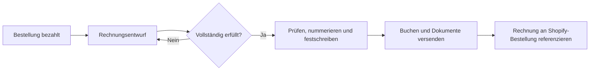

## Verbindung herstellen

1. Öffne **Einstellungen → Verbindungen**.
2. Gib die Domain im Format `dein-shop.myshopify.com` ein.
3. Bestätige die von Zahleon angefragten Berechtigungen bei Shopify.
4. Prüfe anschließend den Verbindungs- und Webhook-Status in Zahleon.

Hinterlege vor dem ersten automatischen Versand unter **Einstellungen → Verbindungen → Shopify-Rechnungsanhänge** jeweils eine PDF-Version der AGB und der Widerrufsbelehrung. Jede Version erhält ein Gültig-ab-Datum und bleibt unveränderlich erhalten.

Deine öffentliche Shop-Domain wie `shop.example.com` ist nicht die Installationsdomain. Verwende immer die unveränderliche `myshopify.com`-Adresse.

Wenn Zahleon zusätzliche Shopify-Berechtigungen benötigt, musst du die
Verbindung einmal neu autorisieren. Erst danach kann Shopify die neuen
Berechtigungen gewähren. Zahleon prüft den Berechtigungsstand beim
Verbindungsaufbau und meldet fehlende Berechtigungen sichtbar.

<Warning>
  Der hier beschriebene Ablauf ist im lokalen Zahleon-Code implementiert
  und automatisiert getestet. Die vollständige End-to-End-Abnahme in
  einem echten Shopify-Dev-Shop ist noch nicht abgeschlossen. Nutze diese
  Vorschau deshalb noch nicht als Produktionsfreigabe.
</Warning>

## Eingebettete Shopify-App

Nach der Installation kannst du die Zahleon-Ansichten direkt im
Shopify-Admin öffnen. Die eingebettete App verwendet die Shopify-Sitzung
für den sichtbaren Aufruf; dauerhafte Hintergrundzugriffe bleiben
serverseitig an den autorisierten Shop gebunden.

Zahleon registriert die benötigten Bestell-, Retouren-, Erstattungs-,
Datenschutz- und Deinstallationsereignisse. Schlägt eine Registrierung
vorübergehend fehl, bleibt sie sichtbar offen und kann erneut versucht
werden.

## Rechnungsablauf

- **Bezahlt:** Zahleon legt einen Entwurf ohne Rechnungsnummer und ohne Buchung an.
- **Vollständig erfüllt:** Zahleon prüft Summen, Steuerfall und Kundendaten. Nur ein sicherer Entwurf wird nummeriert, festgeschrieben und gebucht.
- **Erfüllt vor bezahlt:** Zahleon stellt noch nicht fest. Meldet Shopify
  später die Zahlung und die Bestellung ist dann bereits vollständig
  erfüllt, holt Zahleon die Festschreibung nach.
- **Versand:** Der Kunde erhält die Rechnung und die zu diesem Zeitpunkt gültigen, versionierten AGB und die Widerrufsbelehrung.
- **Shopify-Referenz:** Zahleon lädt die PDF in Shopify Files und legt eine Dateireferenz an der Bestellung ab.

Die für diesen Vorgang erzeugte Rechnungs-PDF wird eingefroren. E-Mail
und Shopify-Referenz besitzen getrennte Zustände. Ein Zustellfehler macht
die bereits festgeschriebene Rechnung oder Buchung nicht rückgängig und
darf nicht als erfolgreicher Versand erscheinen.

## Storno, Retoure und Erstattung

Eine Retoure ist zunächst ein Warenereignis. Sie erzeugt nicht automatisch eine finanzielle Gegenbuchung. Erst eine erfolgreiche Erstattung oder eine vollständige Stornierung erzeugt das passende Korrekturdokument.

Zahleon berücksichtigt bereits tatsächlich gebuchte Korrekturbeträge.
Eine Stornierung und ein zusätzlicher Refund dürfen denselben Umsatz
nicht doppelt korrigieren. Ein blockiertes, nicht gebuchtes
Korrekturdokument zählt dabei nicht als neutralisiert.

<Warning>
  Ein blockierter Entwurf verbraucht keine Rechnungsnummer. Prüfe die angezeigte Ursache, statt unklare Daten zu bestätigen.
</Warning>

## Typische Blocker

- Rechnungsanschrift, Land oder E-Mail fehlen.
- Positionen, Rabatte, Steuer und Gesamtsumme stimmen nicht überein.
- Fremdwährung besitzt keinen bestätigten Wechselkurs.
- EU-B2B, OSS, Steuerbefreiung oder ein anderer Sonderfall ist nicht eindeutig.
- Für den Steuersatz fehlt ein bestätigtes Buchungsmapping.

## Noch offene Betriebsgrenzen

Der lokale Schutz gegen parallele Verarbeitung gilt derzeit nur innerhalb
eines einzelnen Zahleon-Prozesses. Für den Betrieb mit mehreren
Serverinstanzen fehlen noch Datenbank-Locks und Transaktionen. Auch ein
asynchroner Worker mit automatischem Backoff, Fehlerablage und
zeitgesteuerten Wiederholungen ist noch nicht produktiv freigegeben.
