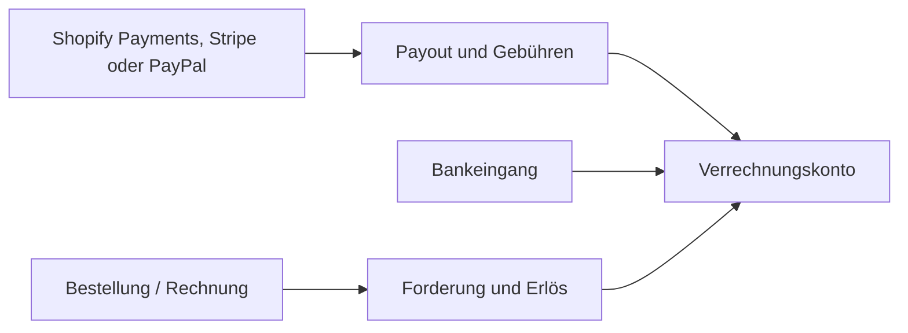

Eine Shopify-Bestellung erzeugt den Erlös. Ein späteres Payout erzeugt nicht denselben Erlös erneut. Zahleon zerlegt Auszahlungen in Geldbewegung, Gebühren, Retouren und sonstige Bestandteile und gleicht sie gegen das Verrechnungskonto ab.

## Warum ein Verrechnungskonto nötig ist

Zahlungsdienstleister zahlen meist Sammelbeträge nach Abzug von Gebühren und Erstattungen aus. Das Verrechnungskonto verbindet Einzelumsätze, Payout und tatsächlichen Bankeingang, ohne Gebühren als Erlösminderung zu verstecken.

## Nicht automatisch zuordnen

Zahleon blockiert den automatischen Abschluss, wenn Referenz, Betrag, Währung oder Status nicht eindeutig sind. Ein unsicheres Matching bleibt als offener Posten sichtbar.

## Verfügbarkeit der Anbieter

Der Abruf von Shopify-Payments-Auszahlungen ist als lokale Vorschau
implementiert und automatisiert getestet. Er verarbeitet derzeit
EUR-Auszahlungen. Eindeutige Bestell- und Erstattungsreferenzen werden
zugeordnet; mehrdeutige Fälle bleiben zur manuellen Klärung offen.

<Warning>
  Ein automatischer Zeitplan und die vollständige End-to-End-Abnahme in
  einem echten Shopify-Dev-Shop fehlen noch. Stripe- und
  PayPal-Händlerauszahlungen sind ebenfalls noch nicht allgemein
  freigegeben. Die Zahleon-Abonnementzahlung über Stripe ist davon
  technisch getrennt.
</Warning>
