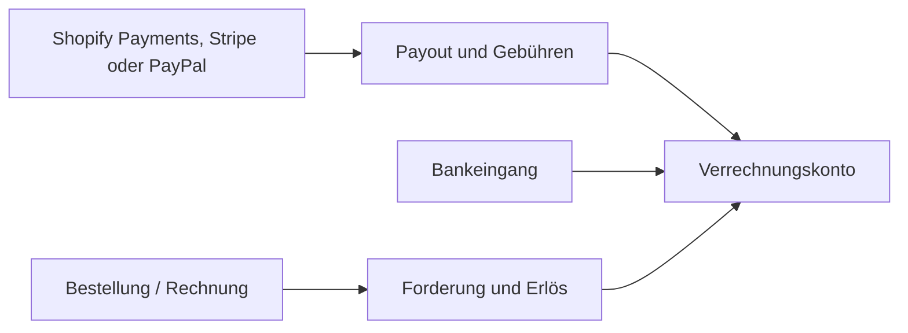

Eine Shopify-Bestellung erzeugt den Erlös. Ein späteres Payout erzeugt nicht denselben Erlös erneut. Zahleon zerlegt Auszahlungen in Geldbewegung, Gebühren, Retouren und sonstige Bestandteile und gleicht sie gegen das Verrechnungskonto ab.

## Warum ein Verrechnungskonto nötig ist

Zahlungsdienstleister zahlen meist Sammelbeträge nach Abzug von Gebühren und Erstattungen aus. Das Verrechnungskonto verbindet Einzelumsätze, Payout und tatsächlichen Bankeingang, ohne Gebühren als Erlösminderung zu verstecken.

## Konten nach Kontenrahmen

Zahleon verwendet überall denselben zweistufigen Ablauf: Der Umsatz
entsteht beim Festschreiben der Rechnung. Zahlung und Payout gleichen
danach nur Forderung und Verrechnungskonto aus.

| Zweck | SKR03 | SKR04 | SKR07 |
| --- | --- | --- | --- |
| Bank | `1200` | `1800` | `2800` |
| Forderungen | `1400` | `1200` | `2000` |
| PayPal / Stripe | `1210` | `1810` | `2810` |
| Shopify Payments | `1361` | `1460` | `2870` |

Eine Auszahlung vom Provider auf die Bank ist eine reine Umbuchung.
Zahleon erzeugt dabei keinen neuen Erlös und keine neue Umsatzsteuer.

## Gebühren

- PayPal verwendet in Deutschland `6855` ohne Steuerzeile.
- Stripe verwendet in SKR03 `4970` und in SKR04 `6855` mit Reverse Charge.
- In SKR07 verwenden PayPal und Stripe `7790`. Zahleon bildet das
  virtuelle Reverse-Charge-Paar `2520` / `3520` mit 20 %.
- Shopify-Payments-Gebühren folgen der Stripe-/Reverse-Charge-Logik und
  laufen gegen das eigene Shopify-Verrechnungskonto.

Monatliche Gebühren-PDFs werden nicht erneut als Ausgabe gebucht, wenn
die API-Gebühren bereits vorhanden sind. Details findest du unter
[Provider-Sammelabrechnungen](/guides/provider-sammelabrechnungen).

## Nicht automatisch zuordnen

Zahleon blockiert den automatischen Abschluss, wenn Referenz, Betrag, Währung oder Status nicht eindeutig sind. Ein unsicheres Matching bleibt als offener Posten sichtbar.

## Verfügbarkeit der Anbieter

Der Abruf von Shopify-Payments-Auszahlungen ist als lokale Vorschau
implementiert und automatisiert getestet. Er verarbeitet derzeit
EUR-Auszahlungen. Eindeutige Bestell- und Erstattungsreferenzen werden
zugeordnet; mehrdeutige Fälle bleiben zur manuellen Klärung offen.

<Warning>
  Ein automatischer Zeitplan und die vollständige End-to-End-Abnahme in
  einem echten Shopify-Dev-Shop fehlen noch. Die hier beschriebene
  Buchungs- und Abgleichslogik ist implementiert und automatisiert
  getestet. Die Zahleon-Abonnementzahlung über Stripe ist davon technisch
  getrennt.
</Warning>
